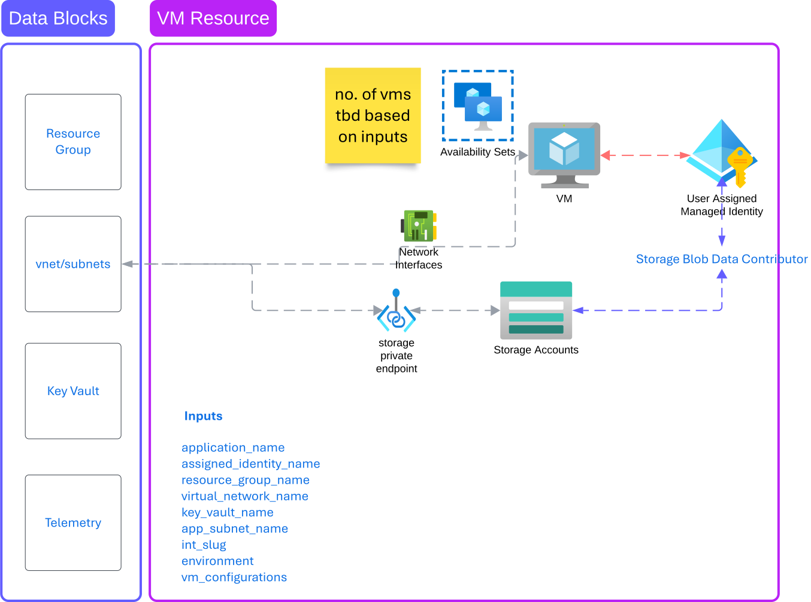

## Pattern Module: VM Resource | v1.0

### 1. Introduction

Welcome!

This repo creates VM resources in a target subscription within an existing resource group. These resources provide compute, storage, and networking capabilities that can be utilized by application teams. This repository contains Terraform configurations for deploying a set of Azure resources centered around Virtual Machines. The deployment includes VMs, storage accounts, network interfaces, and associated resources. The pipeline automates the deployment process, ensuring consistent and repeatable infrastructure provisioning.



The following resources are deployed:

- Virtual Machines (number based on inputs of the `vm_configurations` map input)
- Network Interfaces
- Availability Sets
- User Assigned Managed Identity
- Storage Private Endpoint

### 2. Getting Started

**Running the Code**

- Make sure you also enable Allow GitHub Actions to create and approve pull requests under `Settings > Actions`
- Clone locally to test -- **DO NOT COMMIT DIRECTLY ON MAIN**
  - The code is set up to trigger on pushes on main. Make sure to follow the approved workflow from `topic branch > main`
- Update the `inputs.tfvar` file with the configurations needed for the terraform.

### Inputs

The following inputs are required for this module:

- application_name
- assigned_identity_name
- resource_group_name
- virtual_network_name
- key_vault_name
- app_subnet_name
- int_slug
- environment
- vm_configurations

```pwsh
application_name       = ""
assigned_identity_name = "this"
resource_group_name    = "rg-poc-dev-658"   # Pull from the outputs.tf from the github enterprise spoke pattern workflow
virtual_network_name   = "vnet-poc-dev-658"  # Pull from the outputs.tf from the github enterprise spoke pattern workflow
key_vault_name         = "kv-poc-dev-658"   #  Pull from the outputs.tf from the github enterprise spoke pattern workflow
subnet_name            = "webappsubnet"
int_slug               = "413" #  Pull from the outputs.tf from the github enterprise spoke pattern workflow
environment            = "dev"
vm_configurations = {
  vm1 = {
    size           = "Standard_D4as_v5"
    os_type        = "Windows"
    name           = "VM"
    admin_username = "iamroot"
    number_of_nics = 2
  }
  vm2 = {
    size           = "Standard_D4as_v5"
    os_type        = "Windows"
    name           = "VM"
    admin_username = "iamroot"
    number_of_nics = 1
  }
}
```

### Build, Test, and Validate Instructions

#### Local Development

1. **Clone the Repository**:

   ```sh
   git clone <repository-url>
   cd <repository-directory>
   ```

2. **Set Up Azure CLI**:

   - Install Azure CLI: [Azure CLI Installation Guide](https://docs.microsoft.com/en-us/cli/azure/install-azure-cli)
   - Log in to Azure:
     ```sh
     az login
     ```

3. **Initialize Terraform**:

   ```sh
   terraform init
   ```

4. **Format and Validate Terraform Configuration**:

   ```sh
   terraform fmt
   terraform validate
   ```

5. **Plan Terraform Deployment**:

   ```sh
   terraform plan -var-file inputs.tfvars -out tfplan
   ```

6. **Apply Terraform Configuration**:

   ```sh
   terraform apply -auto-approve tfplan
   ```

7. **Destroy Resources (if needed)**:
   ```sh
   terraform destroy -var-file inputs.tfvars
   ```

#### Production

1. **Configure GitHub Secrets**:

   - Ensure the following secrets are set in your GitHub repository settings:
     - `AZURE_CLIENT_ID`
     - `AZURE_CLIENT_SECRET`
     - `AZURE_TENANT_ID`
     - `AZURE_SUBSCRIPTION_ID`
     - `AZURE_CREDENTIALS`

2. **Trigger Workflow**:

   - Push changes to a branch or create a pull request to trigger the pipeline.

3. **Monitor Pipeline Execution**:

   - Check the GitHub Actions tab to monitor the pipeline progress and ensure all steps complete successfully.

4. **Review Deployment**:
   - Verify the deployed resources in the Azure portal to ensure they match the expected configuration.

### 3. Repository Structure

**Template Layout**

The repo template follows this basic pattern. The pattern may be extended based off of the product teams requirements.

| Name            | Type   | Description                                                                                                         | Use                                                                                                                                                                |
| --------------- | ------ | ------------------------------------------------------------------------------------------------------------------- | ------------------------------------------------------------------------------------------------------------------------------------------------------------------ |
| `.github/`      | Folder | Contains GitHub-specific configuration files like GitHub Actions workflows for CI/CD automation.                    | - Automate testing, plan, and apply Terraform configurations. <br> - Manage pull requests and issue tracking integration.                                          |
| `examples/`     | Folder | Contains example Terraform configurations that demonstrate how to use the module or project in different scenarios. | - Provide users with real-world examples. <br> - Help new users understand module usage and best practices.                                                        |
| `modules/`      | Folder | Contains reusable Terraform modules that can be referenced in Terraform configurations.                             | - Encapsulate complex logic into reusable components. <br> - Simplify main configurations by modularizing resources.                                               |
| `tests/`        | Folder | Contains automated tests for the Terraform configurations, often using frameworks like Terratest.                   | - Ensure the reliability and correctness of Terraform code. <br> - Automatically test configurations in different scenarios before deployment.                     |
| `locals.tf`     | File   | Used to define local values within the Terraform configuration.                                                     | - Simplify complex expressions repeated in multiple places. <br> - Enhance readability and maintenance. <br> - Reduce errors by avoiding repetition.               |
| `main.tf`       | File   | Typically the primary entry point of your Terraform configuration containing core resource definitions.             | - Define resources that Terraform will manage. <br> - Include settings for providers.                                                                              |
| `outputs.tf`    | File   | Defines output values to return information about resources created by Terraform.                                   | - Display useful information to the user. <br> - Share data between Terraform modules. <br> - Output attributes for use by external tools or other configurations. |
| `provider.tf`   | File   | Often used to define Terraform configuration settings like version and backend configuration.                       | - Specify Terraform version and provider versions. <br> - Configure backend for state management. <br> - Set up provider settings.                                 |
| `inputs.tfvars` | File   | Used to define values for your variables that will be applied across the configuration.                             | - Provide a way to set or override variable values externally. <br> - Keep sensitive data or environment-specific settings out of version control.                 |
| `variables.tf`  | File   | Used to define the input variables for a Terraform module.                                                          | - Define inputs to your Terraform configurations. <br> - Set default values and descriptions for readability and maintenance. <br> - Allow customization.          |

**Directory Structure**

The directory structure can be added to, however nothing should be removed from the baseline layout.

**Naming Conventions**

> The naming conventions used for all repositories, modules, and resources deployed using our patterns are strongly based on the[ Pattern Module Requirements](https://azure.github.io/Azure-Verified-Modules/specs/shared/#pattern-module-requirements) as documented in the Azure Verified Modules. We will periodically update our standards to align with the guidlines, as needed.

| Naming Conventions                                                                |
| --------------------------------------------------------------------------------- |
| Pattern name for GitHub Repo \| `{business unit}-{iac}-ptn-{pattern module name}` |
| Example: `ent-tf-ptn-lvl0-enterpriseplatform                                      |

| Segments                | Description                                                                                                                                                 |
| ----------------------- | ----------------------------------------------------------------------------------------------------------------------------------------------------------- |
| `{business unit}`       | Follows our standard repo naming convention. `ent` will be used for all pattern module repo names to indicate it is a shared service across the enterprise. |
| `{iac}`                 | logical naming convention representing the code that the pattern module is written in.                                                                      |
| `ptn`                   | Indicates if it is a pattern (deploys multiple resources and modules together) or a resource (deploys a primary, single resource).                          |
| `{pattern module name}` | describing the module’s function.                                                                                                                           |

### Frequently Asked Questions (FAQ)

#### Subnets needs to be a list of Objects

**Issue**:

```
Error: Invalid function argument
│
│   on locals.tf line 9, in locals:
│    9:   subnet_keys   = keys(var.subnets_and_sizes)
│
│ Invalid value for "inputMap" parameter: must have map or object type.
```

**Resolution**:
The `subnets_and_sizes` variable should be a map, not a list of objects. Update the variable type and definition to reflect this.

**Troubleshooting Steps**:

1. Modify `variables.tf`:

   ```hcl
   variable "subnets_and_sizes" {
     type = map(object({
       name        = string
       prefix_size = number
     }))
     description = "A map of subnets to create in the virtual network"
   }
   ```

2. Update `locals.tf` accordingly.

#### Key Vault Creation Error - Soft Deleted Vault Does Not Exist

**Issue**:

```
Error: Code="SoftDeletedVaultDoesNotExist" Message="A soft deleted vault with the given name does not exist.
```

**Resolution**:
Permanently delete the soft-deleted vault from the Azure portal before creating a new one with the same name.

**Troubleshooting Steps**:

1. Go to the Azure portal.
2. Navigate to the Key Vaults section.
3. Permanently delete the soft-deleted vault.

#### Azure Key Vault Network ACLs Error

**Issue**:
Terraform is not able to deploy a secret to the Key Vault as part of its configuration because public access to the Key Vault is not allowed by default.

```
Invalid value found at properties.networkAcls.ipRules[0].value: {`input value`} belongs to forbidden range 10.0.0.0–10.255.255.255 (private IP addresses)
```

**Resolution**:
Private IP addresses cannot be used in network ACLs for public key vaults. You must add the Application Registration secret in a separate step of the GitHub workflow.

**Troubleshooting Steps**:

1. Manually create a secret in the app registration created by the resource and add it to the Key Vault for the spoke.

#### Error in Terraform Apply - Failed to Retrieve Resource

This error may occur if the provider configuration is not using the specified authentication type that is required to deploy the resources. When this resource is deployed using a self-hosted GitHub Runner, a new container is created and uses `msi` authentication via the `Azure/Login@v1` action.

See [Authentication with the AzureRM provider](https://developer.hashicorp.com/terraform/language/settings/backends/azurerm#authentication) for more details.

**Issue**:

```
Error: Failed to retrieve resource
```

**Resolution**:
The `msi` auth value needs to be enabled for this work correctly. Ensure the Azure Managed Identity is properly configured (in the `providers.tf` file) and has the necessary permissions.

**Troubleshooting Steps**:

1. verify the provider is configured correctly.
2. Assign the required roles to the managed identity.

#### Invalid Resource Name

**Issue**:

```
Error: The specified resource name contains invalid characters.
```

**Resolution**:
Ensure that all resources deployed adhere to Azure naming rules.

**Troubleshooting Steps**:

1. The `Application_Name` should be as short as possible. Consider putting the full name of the application/workload in the `description` tag that is deployed with the resource group.
2. Verify the names contain only lowercase letters, numbers, and hyphens.
3. Ensure the names meet the length requirements.

### Conclusion

This README provides a summary of the Terraform deployment and instructions for building, testing, and validating the system both locally and through the production pipeline. The FAQ section addresses common issues and their resolutions, ensuring a smoother development and deployment process.
